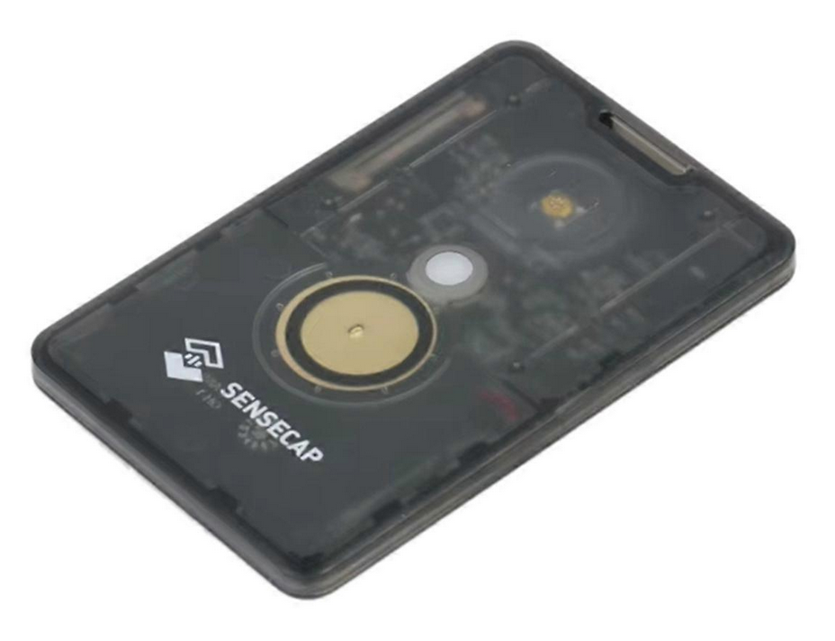

# Helium Mapper
*Experimental Helium IoT coverage mapping device,
coded in Arduino running on Seeed Studio T1000-E LoRaWAN GPS tracker.*

## Usage
This software turns a T1000-E into a custom OpenSource Helium mapping device.
It sends the current GPS location via Helium LoRaWAN to community projects like
[mappers.helium.com](https://docs.helium.com/iot/coverage-mapping/)
[helium.coveragemap.net](https://www.coveragemap.net/2024/02/28/mapping-with-chirpstack/)
[mappers.hexato.io](https://mappers.hexato.io/docs)

## Remark
The LoRaWAN uplink payload decoder works only on ChirpStack-based LNS (LoRaWAN Network Server),
and at the moment not all community projects can handle those uplink metadata...

## Disclaimer
This code is based on Seeed Studio's  [T1000-E Arduino example code](https://wiki.seeedstudio.com/t1000_e_arduino_examples/)
 and contains code snippets from many sources...
 
 It's an experiment for proof-of-concept,
 as a starting point for other developers :-)
